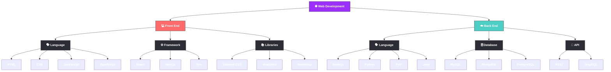

# **Happy to see you here, I'm Ishan Majumder 💻**
### A software engineer with a passion for automation

Hey! I’m a student and developer who enjoys turning ideas into practical projects and exploring how technology can automate everyday problems.

 

### **My Workflow**

            

Beyond software, I have an avid interest in microcontrollers and DIY electronics. I enjoy experimenting with boards like Arduino and ESP32, connecting sensors and modules, and figuring out how software and hardware can work together to create something useful.

 

 

### **Tech Stack**

                           

I’m particularly interested in automation, web development, and hardware-based projects. I work primarily with JavaScript and Node.js, and I’m comfortable building applications with frameworks and technologies such as React, Express.js, and MongoDB.

I’m naturally curious and love exploring new technologies, tools, and concepts—even outside my usual stack. Whether it’s building a web application, automating a repetitive task, or putting together a small electronics project, I enjoy learning by actually building things.

Always open to interesting projects, new technologies, and opportunities to learn something new.

   

  
  
  

  
  

### **Lets build something together** 

     

 

